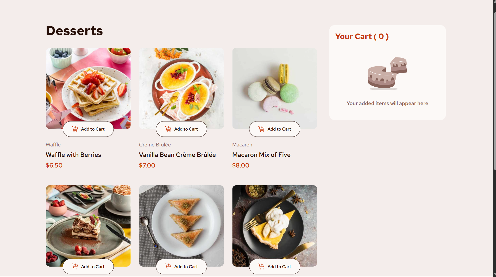
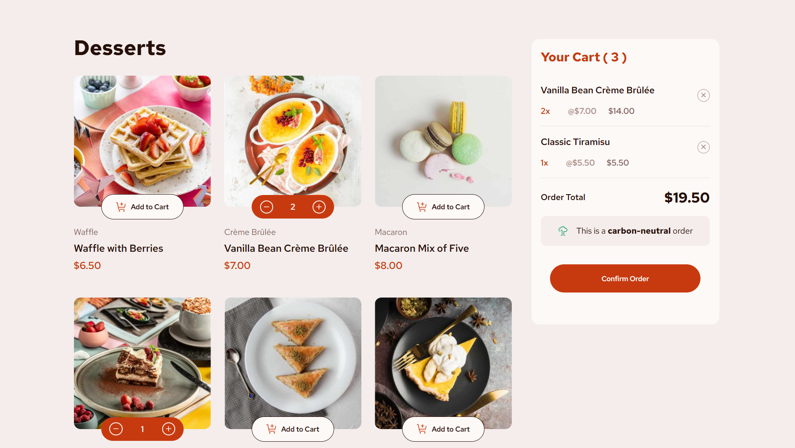
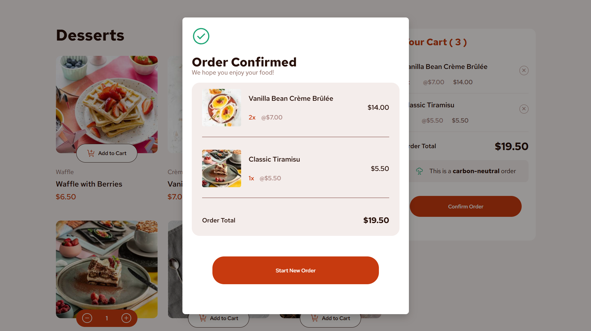

# Frontend Mentor - Product list with cart solution

This is a solution to the [Product list with cart challenge on Frontend Mentor](https://www.frontendmentor.io/challenges/product-list-with-cart-5MmqLVAp_d), implemented for Task 1 of the Konecta Full Stack summer intership.

## Table of contents

-   [Overview](#overview)
    -   [The challenge](#the-challenge)
    -   [Screenshot](#screenshot)
    -   [Links](#links)
-   [My process](#my-process)
    -   [Built with](#built-with)
    -   [What I learned](#what-i-learned)
    -   [Continued development](#continued-development)
    -   [Useful resources](#useful-resources)
-   [Author](#author)
-   [Acknowledgments](#acknowledgments)

## Overview

### The challenge

Users should be able to:

-   Add items to the cart and remove them
-   Increase/decrease the number of items in the cart
-   See an order confirmation modal when they click "Confirm Order"
-   Reset their selections when they click "Start New Order"
-   View the optimal layout for the interface depending on their device's screen size
-   See hover and focus states for all interactive elements on the page

### Screenshot

## My process

### Built with

-   HTML, CSS and Javascript

### What I learned

This task was a great opportunity for me to revise my knowledge of HTML and CSS, since I have not used them in a while.
